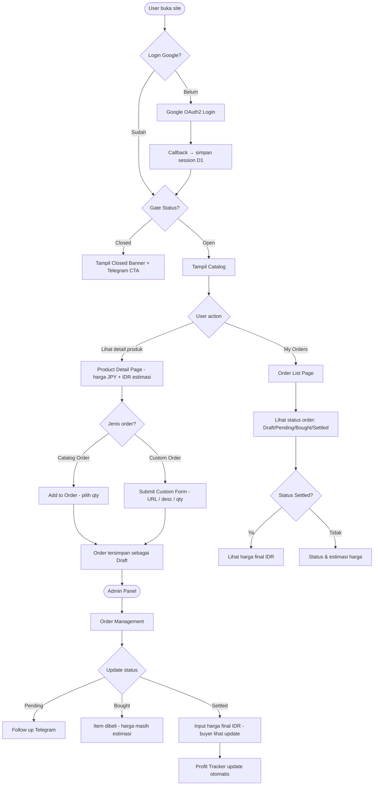
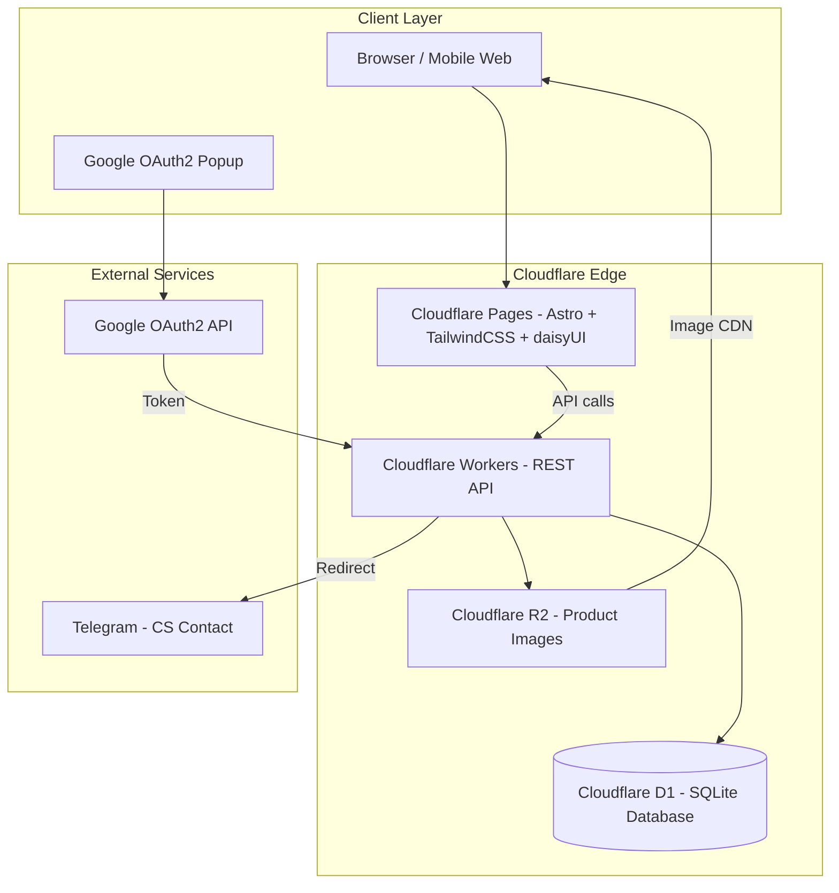

# Kotemart Jastip Catalog — Internal Technical Specification
**Version:** v01
**Generated:** 2026-06-16
**Stack:** Astro + TailwindCSS + daisyUI + HonoJS on Cloudflare Pages/Workers, D1 + R2, Google OAuth2

---

## 1. Scope of Work

### In Scope
- Google OAuth2 authentication flow (custom, via Cloudflare Workers)
- Jastip gate management (open/close toggle with buyer-visible status)
- Product catalog: listing, detail pages, categories, photo upload to R2
- JPY pricing with admin-managed rate + fee% → auto-generated IDR estimate (snapshot per product)
- Order List: buyer adds catalog or custom orders while gate is Open; locked when gate is Closed
- Custom Order: buyer submits URL / description / qty form for out-of-catalog items
- Order Management: admin updates status (Draft → Pending → Bought → Settled), inputs HPP and final IDR price at Settled
- Buyer Order History: real-time status view, see confirmed final price when Settled
- Profit Tracker: admin dashboard showing revenue, HPP, gross profit per jastip batch (calculated from Settled orders only)
- Admin Panel: CRUD catalog, bulk/single photo upload to R2, global settings (JPY rate, fee%, Telegram link), user management

### Out of Scope
- Payment gateway / online payment processing
- Shopping cart / checkout flow
- Automated shipment tracking (no carrier API integration)
- Multi-admin roles or RBAC permissions
- Product review / rating system
- Real-time JPY rate from external API (rate is admin-controlled only)

---

## 2. Tech Stack

| Layer | Technology | Notes |
|---|---|---|
| Frontend | Cloudflare Pages (Astro + TailwindCSS + daisyUI) | SSG-first with SSR hydration; Tailwind utility classes + daisyUI component primitives |
| Backend API | Cloudflare Workers (Hono.js) | REST API, edge-deployed |
| UI Framework | TailwindCSS v4 + daisyUI v5 | Utility-first CSS + prebuilt accessible components (buttons, modals, badges, tables) |
| CSS Methodology | DESIGN.md tokens → Tailwind config | DESIGN.md defines the design tokens; Tailwind config maps tokens → utility classes; daisyUI themes from DESIGN.md palette |
| Database | Cloudflare D1 (SQLite) | Sessions, products, orders, settings |
| File Storage | Cloudflare R2 | Product images, served via public R2 CDN URL |
| Auth | Google OAuth2 (custom flow) | Worker handles callback, stores session in D1 |
| External | Google OAuth2 API | Auth only |
| External | Telegram | CS contact link only (not API integration) |

---

## 3. Application Flow

---

## 4. Technical Architecture

---

## 5. Functional Requirements

### Auth
- FR-01: User dapat login menggunakan akun Google via OAuth2 flow
- FR-02: Worker menangani callback OAuth2, menyimpan session token di D1
- FR-03: Semua halaman (kecuali login) memerlukan session yang valid
- FR-04: User dapat logout (session dihapus dari D1)

### Catalog
- FR-05: Catalog menampilkan daftar produk dengan foto, nama, harga JPY, dan harga IDR estimasi
- FR-06: Product detail page menampilkan full info: foto gallery, deskripsi, kategori, harga JPY, IDR estimasi, disclaimer estimasi
- FR-07: Produk dapat difilter per kategori
- FR-08: Admin dapat membuat, mengedit, menghapus produk
- FR-09: Admin dapat upload satu atau lebih foto produk ke R2; URL foto disimpan di D1

### Jastip Gate
- FR-10: Admin dapat toggle status jastip: Open atau Closed
- FR-11: Saat gate Closed, buyer melihat banner "Jastip sedang tutup" beserta link Telegram
- FR-12: Saat gate Closed, buyer tidak dapat menambahkan order baru (form disabled)
- FR-13: Saat gate Open, catalog dan order form aktif

### Order List (Catalog Order)
- FR-14: Buyer dapat menambahkan produk catalog ke order list (pilih qty)
- FR-15: Order catalog tersimpan dengan status Draft
- FR-16: Buyer dapat melihat semua order mereka beserta status terkini
- FR-17: Buyer melihat harga IDR final ketika status order = Settled

### Custom Order
- FR-18: Buyer dapat mengisi form custom order: URL produk, nama/deskripsi, qty, catatan
- FR-19: Custom order tersimpan dengan status Draft dan masuk ke queue admin
- FR-20: Admin dapat mengisi harga JPY + fee% untuk custom order; sistem kalkulasi IDR estimasi (snapshot rate saat itu)

### Order Management (Admin)
- FR-21: Admin dapat melihat semua orders (catalog dan custom) dalam satu view
- FR-22: Admin dapat mengubah status order: Draft → Pending → Bought → Settled
- FR-23: Saat status → Settled, admin menginput harga final IDR; nilai ini tampil di order history buyer
- FR-24: Setiap order menyimpan JPY rate historis saat order dibuat / di-price — tidak berubah walau rate global diupdate

### Profit Tracker (Admin)
- FR-25: Dashboard menampilkan summary per batch jastip: total orders, total revenue IDR, total HPP, gross profit
- FR-26: Kalkulasi profit hanya dari orders berstatus Settled
- FR-27: Admin dapat melihat breakdown per produk/order dalam satu batch

### Admin Panel & Global Settings
- FR-28: Admin dapat set JPY rate (manual, bukan real-time)
- FR-29: Admin dapat set global fee% yang diaplikasikan ke semua harga
- FR-30: Admin dapat set global Telegram link (CTA untuk buyer)
- FR-31: Saat JPY rate diupdate, produk yang sudah ada tidak otomatis recalculate; rate baru hanya berlaku untuk produk yang disimpan ulang
- FR-32: Admin dapat melihat daftar users yang sudah login dan menonaktifkan akses jika perlu

---

## 6. Non-Functional Requirements

- **NFR-01 Performance:** Halaman catalog load dalam ≤ 2 detik pada koneksi 4G (Astro SSG static pages via Cloudflare edge CDN)
- **NFR-02 Availability:** Uptime ≥ 99.9% (SLA Cloudflare Workers)
- **NFR-03 Auth Security:** Session token disimpan di D1 dengan expiry 24 jam; JWT tidak disimpan di localStorage
- **NFR-04 Image Delivery:** Foto produk di-serve via R2 public CDN URL; tidak melalui Worker untuk performa
- **NFR-05 Data Isolation:** Buyer hanya dapat melihat order milik mereka sendiri (filter by user_id)
- **NFR-06 Rate Snapshot:** Setiap order menyimpan `jpy_rate_snapshot` dan `fee_pct_snapshot` saat order dibuat — immutable setelah disimpan
- **NFR-07 Scale:** Dirancang untuk ≤ 1.000 registered users; D1 cukup tanpa sharding
- **NFR-08 Mobile-first:** UI responsive menggunakan daisyUI responsive utilities, optimal di layar mobile (≥ 375px)
- **NFR-09 Astro Build:** Catalog pages SSG (pre-rendered at build time); order/auth pages SSR via Cloudflare adapter (`@astrojs/cloudflare`); admin pages SSR-only (no static pre-rendering)

---

## 7. List of Modules

- **Auth Module** — Google OAuth2 callback handler di Worker; session CRUD di D1 table `sessions`; middleware validasi session untuk semua protected routes; Astro middleware (`src/middleware.ts`) intercepts protected routes
- **Catalog Module** — CRUD endpoints (`/api/products`); R2 upload handler (`/api/products/:id/photos`); category filter; IDR estimasi formula: `price_idr_estimate = price_jpy * jpy_rate * (1 + fee_pct/100)`, disimpan snapshot per produk; Astro pages: `src/pages/catalog/index.astro` (SSG), `src/pages/catalog/[id].astro` (SSG)
- **Jastip Gate Module** — D1 table `settings` key `gate_status`; admin toggle endpoint; middleware gate-check pada order submission endpoints; gate banner rendered server-side di Astro layout
- **Order List Module** — `GET /api/orders/mine` (buyer); `POST /api/orders` (catalog order, requires gate=Open); D1 table `orders` with `type=catalog`, `status`, `user_id`, `product_id`, `qty`, `jpy_rate_snapshot`, `fee_pct_snapshot`, `price_idr_estimate`, `price_idr_final`; Astro page: `src/pages/orders/index.astro` (SSR)
- **Custom Order Module** — `POST /api/orders/custom`; buyer form fields: `product_url`, `product_name`, `qty`, `notes`; admin dapat isi `price_jpy` + kalkulasi IDR estimate; schema extends `orders` table with `type=custom`; form implemented with daisyUI `form-control` + `input` + `textarea` components
- **Order Management Module** — `GET /api/admin/orders` (all orders); `PATCH /api/admin/orders/:id/status`; `PATCH /api/admin/orders/:id/settle` (input `price_idr_final`); history log status per order; admin table uses daisyUI `table` + `badge` + `modal` for status update
- **Profit Tracker Module** — `GET /api/admin/profit?batch=<id>` atau date range; aggregasi dari `orders WHERE status='settled'`; fields: `total_orders`, `total_revenue_idr`, `total_hpp_idr`, `gross_profit_idr`; admin dashboard uses daisyUI `stat` + `card` components; Astro page: `src/pages/admin/profit.astro` (SSR)
- **Admin Panel Module** — CRUD produk UI + API; photo upload to R2 via presigned URL atau direct Worker stream; global settings CRUD (`jpy_rate`, `fee_pct`, `telegram_link`); user list + disable endpoint; all admin pages under `src/pages/admin/` (SSR only via Cloudflare adapter); daisyUI `drawer` for sidebar nav layout; `file-input` component for R2 photo upload
